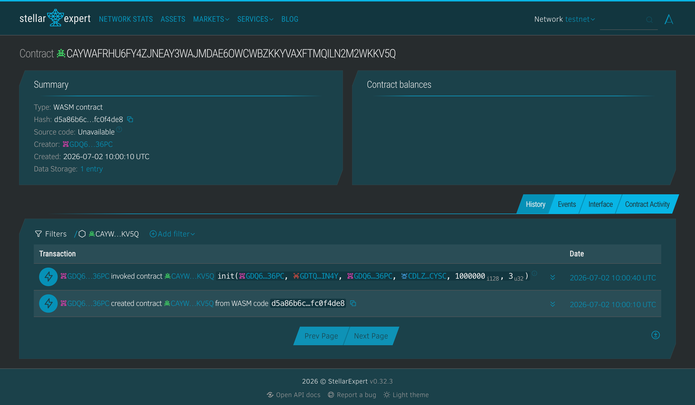

# API Safety Net

> Parametric SLA escrow for API providers, on Stellar/Soroban. Lock a USDC
> guarantee; if your endpoint goes dark past the threshold, the escrow pays the
> subscriber automatically — no lawyers, no disputes, no trust required.

Built for the **Boundless × Trustless Work Hackathon**.

---

## Project Description

Small developers lose money when the APIs they depend on go down, and SLAs are
effectively unenforceable — chasing a refund means emails, invoices, and goodwill.

**API Safety Net** turns an SLA into code. A **provider** locks a USDC guarantee in
an on-chain escrow for a **subscriber**. A health-check **oracle** pings the API on a
schedule. If the endpoint fails a configurable number of consecutive checks, the
escrow **automatically releases** the guarantee to the subscriber. While the API
stays healthy, the provider can reclaim (refund) their funds at any time.

The repository has two parts:

| Path | What it is |
|------|------------|
| [`contracts/`](./contracts) | **Smart-contract codebase** — the `sla-escrow` Soroban contract (Rust) that holds and settles the guarantee on-chain. |
| `src/`, `app/` | **Frontend** — a Next.js 16 app: multi-wallet sign-in, vault creation, the live heartbeat monitor, and the release/refund flows. |

## Project Vision

APIs are the supply chain of modern software, but the guarantees behind them are
just words. Our vision is a world where **uptime promises are collateralized and
self-enforcing** — where any provider can attach a real, on-chain guarantee to their
endpoint, and any subscriber can trust it without a contract or a court. Start with
API uptime; extend the same primitive to any measurable, off-chain service-level
promise (latency, delivery, data freshness), settled instantly on Stellar.

## Key Features

- **Parametric SLA escrow** — funds auto-release after `threshold` consecutive failed
  health checks; no human in the loop.
- **Non-custodial & on-chain** — the guarantee is held by the `sla-escrow` contract,
  not the platform. Settlement is a Soroban transaction anyone can verify.
- **Oracle health checks** — `report_failure` / `report_success` drive a small state
  machine (`Locked → UnderThreat → Disbursed`, with recovery back to `Locked`).
- **Provider refund** — while the API is healthy, the provider reclaims the guarantee.
- **Multi-wallet auth** — sign in with Freighter / Albedo / xBull / Lobstr; one
  signature, no email.
- **Live demo** — “💀 Kill the API” flips a real vault `locked → under_threat →
  disbursed` on chain while you watch.
- **CI/CD** — GitHub Actions build & test the contract and the frontend on every push.

## Smart contract

`sla-escrow` ([`contracts/sla-escrow`](./contracts/sla-escrow)) — a from-scratch
Soroban contract (soroban-sdk 26) implementing the escrow natively.

| Function | Who | Effect |
|----------|-----|--------|
| `init(provider, subscriber, platform, token, amount, threshold)` | anyone (once) | Configure the escrow. |
| `fund()` | provider | Deposit the guarantee into the contract. |
| `report_failure()` | platform oracle | +1 failure; trips to `UnderThreat` at threshold. |
| `report_success()` | platform oracle | Reset the failure streak; recover to `Locked`. |
| `release()` | platform oracle | Pay the guarantee to the subscriber (`UnderThreat` only). |
| `refund()` | provider | Reclaim the guarantee while healthy (`Locked` only). |
| `config()` / `status()` / `failures()` / `funded()` | anyone | Views. |

Covered by 8 unit tests (state machine, token transfers, and auth/guard failures).

### Build, test, deploy

```bash
cd contracts
cargo test                       # unit tests
stellar contract build           # -> target/wasm32v1-none/release/sla_escrow.wasm

# deploy to testnet
stellar keys generate deployer --network testnet --fund
stellar contract deploy \
  --wasm target/wasm32v1-none/release/sla_escrow.wasm \
  --source deployer --network testnet
```

## Testnet Contract Details

| | |
|---|---|
| **Network** | Stellar **Testnet** |
| **Contract ID** | `CAYWAFRHU6FY4ZJNEAY3WAJMDAE6OWCWBZKKYVAXFTMQILN2M2WKKV5Q` |
| **WASM hash** | `d5a86b6c43c61ba29d7b4cf0c65344c8e435e191e7c7a0a8415a2000fc0f4de8` |
| **Explorer** | [stellar.expert →](https://stellar.expert/explorer/testnet/contract/CAYWAFRHU6FY4ZJNEAY3WAJMDAE6OWCWBZKKYVAXFTMQILN2M2WKKV5Q) |
| **Deploy tx** | [`6fd1f12b…`](https://stellar.expert/explorer/testnet/tx/6fd1f12b804d0700e244a15607be2ce4dcf981624a973cc1a1ec5e515d7aeb56) |
| **`init` tx** | [`43865728…`](https://stellar.expert/explorer/testnet/tx/43865728b8eced751c9a4cad479e82afb8cd5edacb899ac479b9c68ee7001d88) |

_Mainnet: not yet deployed — see Future Scope._

Block-explorer view of the deployed contract:



## Frontend

```bash
cp .env.local.example .env.local   # fill in Supabase / Trustless Work / Stellar keys
npm install
npm run dev                        # http://localhost:3000
```

Stack: Next.js 16 (App Router) · Tailwind 4 · `@creit.tech/stellar-wallets-kit` +
`jose` JWT auth · `@stellar/stellar-sdk` · Supabase (Postgres + Realtime).

## CI/CD

Two GitHub Actions workflows in [`.github/workflows`](./.github/workflows):

- **`contract.yml`** — `cargo fmt --check`, `clippy -D warnings`, `cargo test`, and a
  release `wasm32v1-none` build (uploaded as an artifact). Runs on `contracts/**` changes.
- **`frontend.yml`** — `npm install`, `tsc --noEmit`, and `next build` (with build-time
  placeholder env). Runs on frontend changes.

## Future Scope

- **Mainnet deployment** of `sla-escrow` with a real USDC asset.
- **Decentralized oracle** — multiple independent attesters instead of one platform
  key, with m-of-n agreement before release.
- **Tiered / partial payouts** — settle proportional to measured downtime rather than
  all-or-nothing.
- **More SLA dimensions** — latency, error-rate, and data-freshness thresholds.
- **On-chain scheduler** — move health-check cadence on chain so settlement needs no
  browser tab open.
- **Boundless campaign integration** — surface guaranteed endpoints in a marketplace.

## Security

Shai-Hulud supply-chain posture enforced via `.npmrc` (`ignore-scripts`,
`save-exact`); see [`SECURITY.md`](./SECURITY.md).
